# 基于java的在线问卷调查系统

#### 介绍

在当今数字化时代，为了更高效、便捷地收集和分析数据，我们开发了这个基于 Java 的在线问卷调查系统。该系统旨在为管理员和用户提供一个功能强大、易于操作的平台，以满足不同场景下的问卷调查需求。

#### 技术栈

后端技术栈：Springboot+Mysql+Maven

前端技术栈：Vue+Html+Css+Javascript+ElementUI

开发工具：Idea+Vscode+Navicate

#### 系统功能介绍

（一）管理员角色  
个人中心：管理员可以在此查看和修改个人信息，接收系统通知和重要消息。  
管理员管理：对其他管理员的账号进行管理，包括添加新管理员、修改管理员权限、删除管理员账号等操作，以确保管理团队的合理配置和权限分配。  
用户管理：全面掌控用户信息，进行用户的添加、删除、修改、查询等操作，同时对用户的权限和状态进行管理，保障系统的安全性和用户数据的准确性。  
问卷管理：创建、编辑、删除问卷，设置问卷的有效期、发布状态、访问权限等属性，对问卷进行分类和标签管理，方便快速查找和筛选。  
题目管理：设计问卷中的题目，包括选择题、填空题、简答题等多种类型，设置题目选项、分值、必填项等属性，确保题目能够准确收集所需数据。  
问卷调查管理：实时监控问卷的填写情况，包括已填写人数、未填写人数、完成率等数据，对问卷的结果进行初步分析和统计，如选项的分布情况、得分的平均值等。  
新闻资讯管理：发布和编辑与问卷调查相关的新闻、通知、公告等资讯内容，确保用户及时了解系统的最新动态和重要信息。  
基础数据管理：维护系统运行所需的基础数据，如地区信息、行业分类、学历层次等，为问卷设计和数据分析提供数据支持。  
轮播图信息：设置系统首页的轮播图，展示重要的问卷活动、热门调查、系统优势等内容，吸引用户的注意力，提高系统的访问量和参与度。  

（二）用户角色  
问卷列表：用户可以查看系统中所有公开的问卷列表，包括问卷的标题、描述、发布者、有效期等信息，方便选择感兴趣的问卷进行填写。  
新闻资讯：及时了解系统发布的最新新闻和资讯，获取与问卷调查相关的知识和动态。  
个人中心：用户在此可以修改个人资料、查看自己参与过的问卷调查记录和结果，管理自己的账户信息和偏好设置。  
后台管理  
问卷调查管理：查看自己正在进行和已经完成的问卷调查，了解问卷的进度和状态。  
问卷列表：对自己创建或参与的问卷进行分类和管理，方便快速查找和回顾。  
问卷调查记录：查看自己填写问卷的详细记录，包括填写时间、答案内容等信息。  

#### 系统作用

在线问卷调查系统的主要作用包括：  

提升问卷制作效率： 为管理员提供便捷的问卷和题目管理工具，快速创建和发布问卷，提升问卷制作效率。  
优化用户体验： 提供简洁直观的问卷浏览和参与界面，让用户轻松参与问卷调查，并查看参与记录和结果。  
数据分析和统计： 通过问卷调查管理模块，管理员可以方便地查看和分析问卷数据，生成图表和报表，辅助决策。  
信息传递： 通过新闻资讯和轮播图信息，管理员可以及时向用户传递最新的信息和动态。  

#### 系统功能截图

代码结构

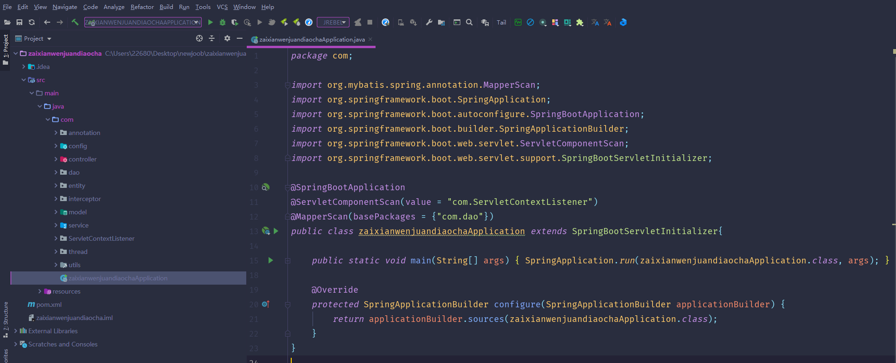

数据库表

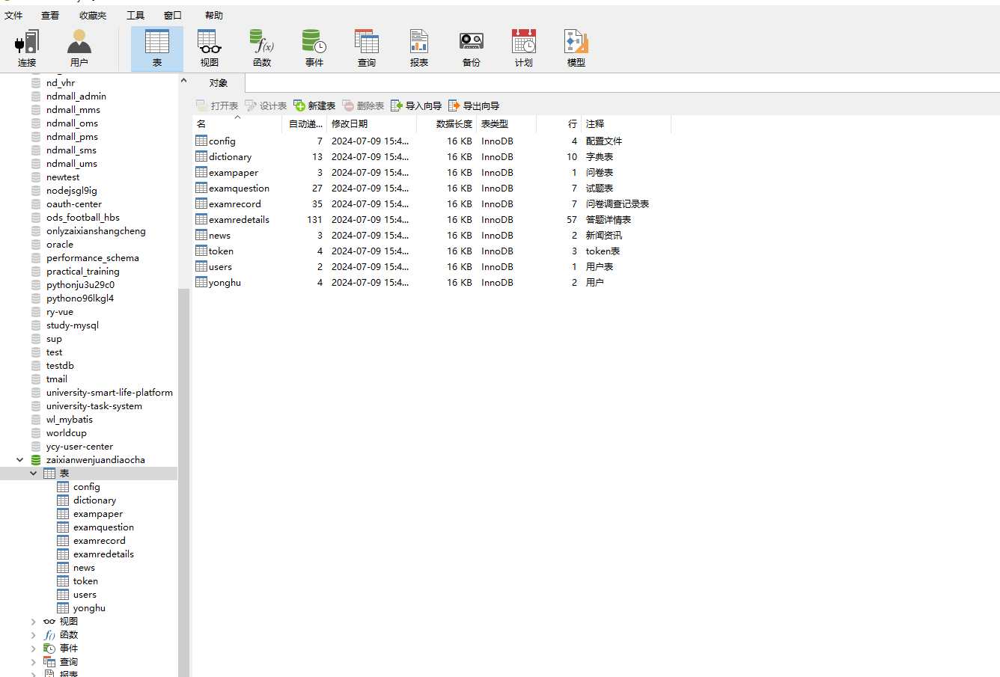

登录

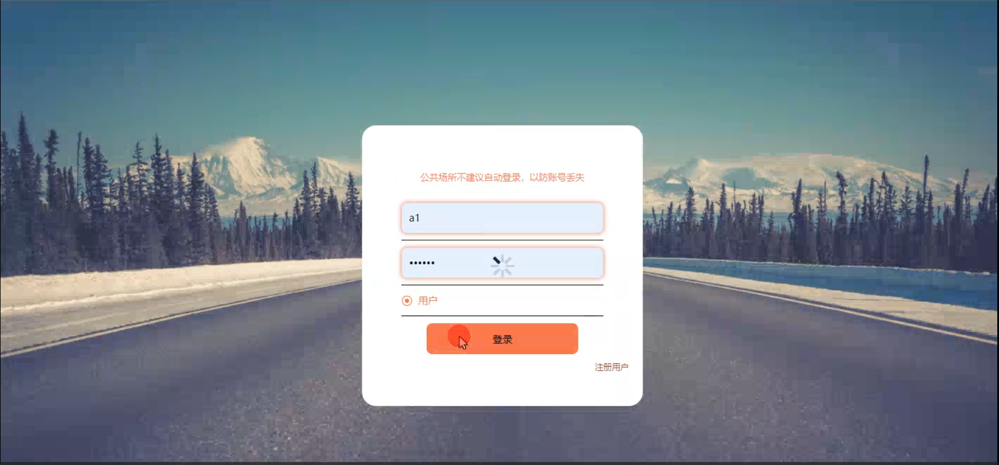

前台页面首页

问卷列表

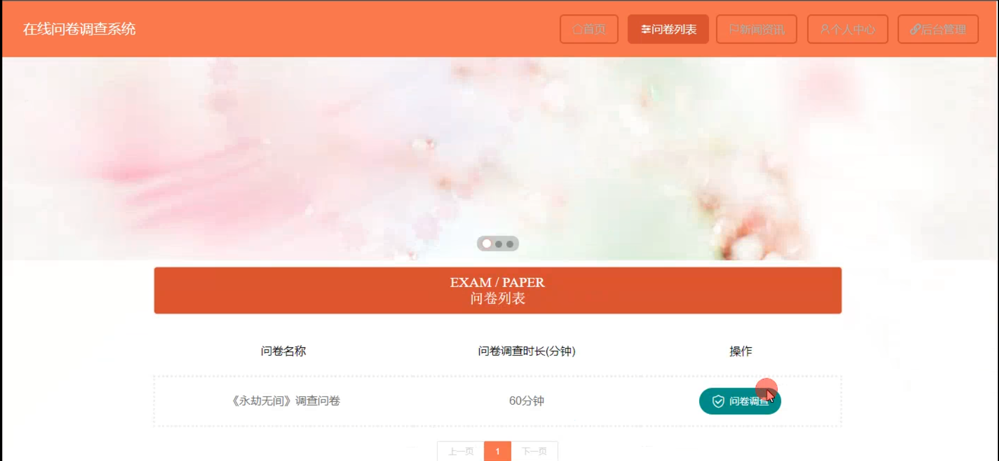

个人中心

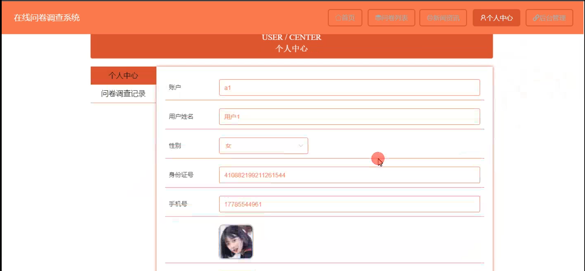

新闻资讯

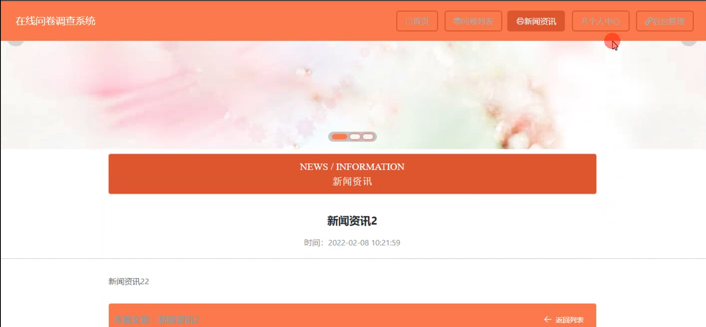

管理员端用户管理

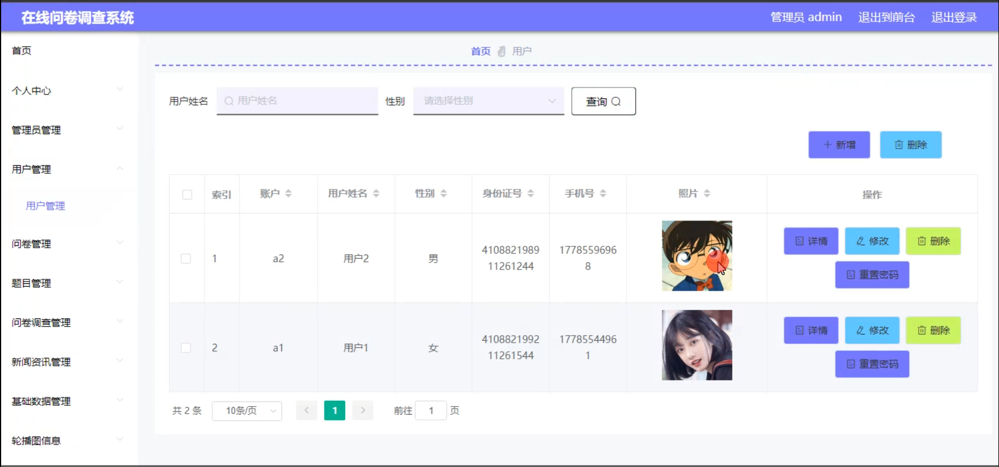

题目管理

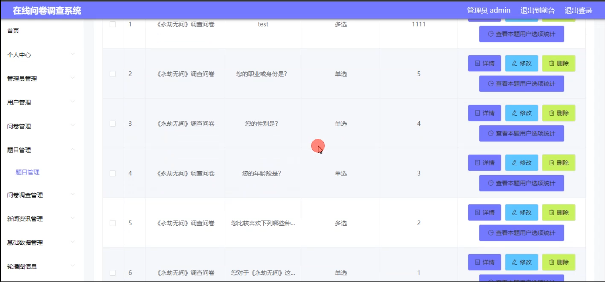

问卷调查管理

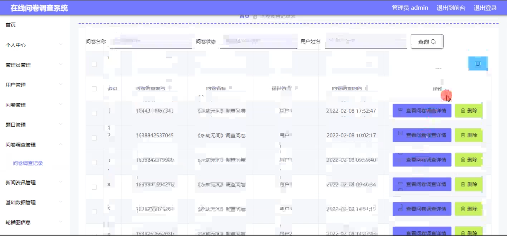

用户端后台管理

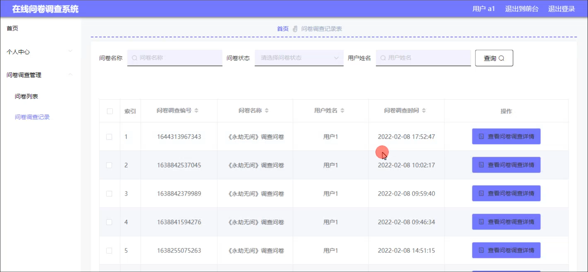

考试界面

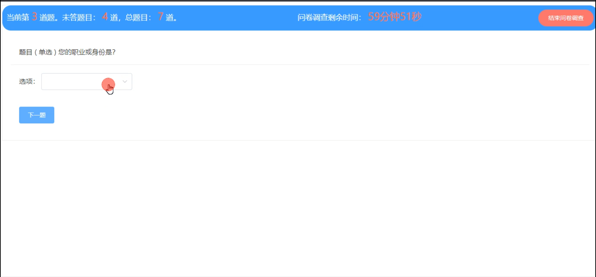

#### 总结

基于 Java 的在线问卷调查系统通过明确的角色划分和丰富的功能模块，为管理员和用户提供了一个高效、便捷、实用的问卷调查平台。管理员能够轻松管理问卷和用户，确保调查的顺利进行和数据的准确收集；用户能够方便地参与调查和查看相关资讯。该系统在市场调研、学术研究、企业管理等领域具有广泛的应用前景，能够有效提升数据收集和分析的效率和质量，为决策提供有力支持。

#### 使用说明

创建数据库，执行数据库脚本 修改jdbc数据库连接参数 下载安装maven依赖jar 启动idea中的springboot项目

前台登录页面
http://localhost:8080/zaixianwenjuandiaocha/front/index.html

后台登录页面
http://localhost:8080/zaixianwenjuandiaocha/admin/dist/index.html

管理员 			账户:admin 		密码：admin